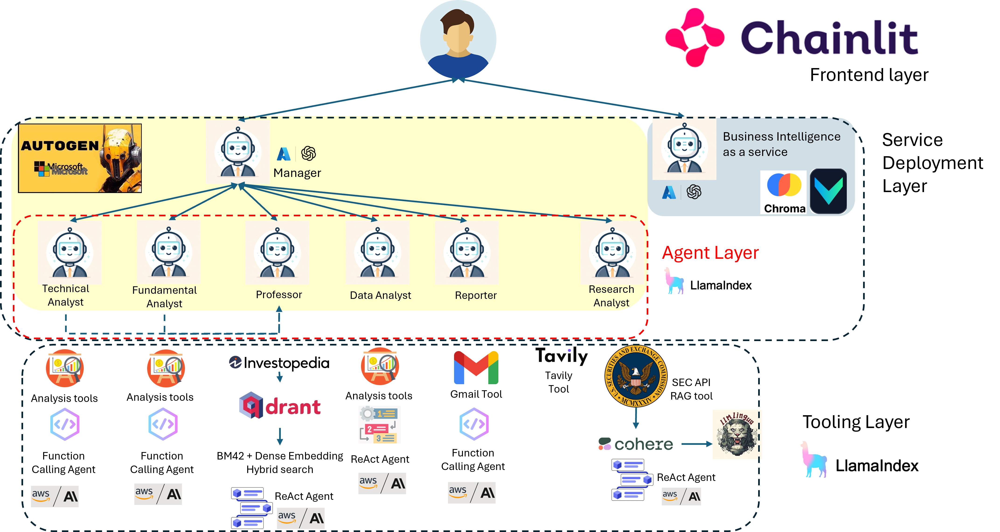

# The Margin Call LLM Group

Welcome to The Margin Call LLM Group!



The Margin Call LLM Group comprises of multiple agents and tools to help you undertake the best investment decisions!

## A demo
[](https://www.youtube.com/watch?v=uLtMD3J4U40)

## Meet the group
The Margin Call LLM Group has:
1. A group chat with all agents, and
2. A workspace where you can get LLM assistance to undertake your own analysis.

### 1. The group chat
1. The Principal Data Analyst: 
- This agent helps customers undertake statistical analysis of financial market data using methods such as correlations, compounded annual growth rate, etc.
- Tools: customized data analysis tool
- To add: None
- Agent Type: ReAct 

2. The Principal Technical Analyst:
- This agent helps customers undertake technical analysis of financial market data using methods such as stochastic relative strength index, bollinger bands, ichimoku cloud, etc.
- Tools: customized data analysis tool
- To add: More technical analysis tools.
- Agent Type: Function calling

3. The Principal Fundamental Analyst:
- This agent helps customers undertake fundamental analysis of companies by looking at financial market data.
- Tools: customized fundamental analysis tools
- To add: None
- Agent Type: Function calling

4. The Principal Researcher
- This agent helps customers undertake analysis of the financial performance of companies by close reading of SEC reports and research articles online.
- Tools: 
    - RAG Tool:
        - Data source: SEC API,
        - Vector Database: LlamaIndex's Simple Vector Store
        - RAG customizations:
            - Cohere rerank
            - Prompt compression using gpt2 
    - Search Tool: Tavily API
- To add: None
- Agent Type: ReAct

5. The Distinguished Professor of Finance
- This agent answers questions on technical definitions, concepts and general questions on how to get started on investments. This agent also reviews the recommendations made by analysts.
- Tools: 
    - RAG tool:
        - Data source: Investopedia articles
        - Vector Database: Qdrant
        - RAG customizations: dense vector and bm42 embedding search
- To add: None
- Agent Type: ReAct

6. The Principal Finance Reporter
- This agent writes compelling report, draft emails and send emails.
- Tools:GmailTool
- To add: None
- Agent Type: ReAct

7. The manager (Autogen Group Chat Manager)

8. The user (that's you!)

#### Design considerations
Agent 1 is the most sophisticated agent because it has the most number of tools within its arsenal ('data analysis' is a very broad domain). In contrast, agents 2 and 3 have only one tool and therefore can be simple function calling agents. Agents 4-6 are ReAct agents because they have a number of tools and their chain of thought might be useful in guiding them to the correct outcome.

Agents 1-6 are LlamaIndex agents wrapped in Autogen's LLamaIndexConversableAgent class, and deployed into Autogen's group chat object.

#### Other avenues explored
1. For the groupchat: Langgraph + crewAI + LlamaIndex tools.
- Unable to elegantly find a way to display intermediate chat messages in crewAI and langgraph.
2. For the professor: dspy-AI + LlamaIndex RAG query engine
- Breaking changes from LlamaIndex and dspy-AI updates caused this idea to be shelved. Prompt optimization is an interesting avenue of exploration.
3. For the professor: LlamaIndex PropertyGraphIndex with Neo4j, QdrantClient
- It costs too much to create the knowledge graph. This idea was canned due to cost considerations. 

### 2. The Workspace
This is an LLM assisted workspace for analysts to undertake business intelligence tasks. Powered by VannaAI and ChromaDB.

Simply ask a query and explore the plotly graphs!

## Folder Structure:
```
.
├── .chainlit                            <- Chainlit translation and toml files
│   ├── translations
│       ├── en-US.json
├── archive                              <- Failed experiments
│   ├── crewAI
│       ├── crew_agents.py
│       ├── crew_tasks.py
│       ├── crew_tools.py
│       ├── crew_utils.py
│       ├── crew.py
│   ├── crew.ipynb
│   ├── crewapp.py
│   ├── llamaindex_dspy_rag.ipynb      
│   ├── llamaindex_qdrant_dspy_rag.ipynb
├── notebooks                             <- Prototyping codes 
├── public                                <- Contains images for chainlit styling
├── src                                   <- Source code for app
│   ├── autogen
│       ├── autogen_utils.py              <- Chainlit abstractions of autogen agents and agent initialization utility functions
│       ├── groupchat.py                  <- Groupchat initialization utility functions
│   ├── db_utils.py                       <- Utility functions for SQL database
│   ├── utils.py                          <- General processing utility functions
│   ├── llamaindex_config.py              <- LlamaIndex LLM and embedding model objects
│   ├── vn_utils.py                       <- Utility functions for VannaAI
├── tools                                 <- Tool construction folder using LlamaIndex
│       ├── calculator_tools.py           <- Wolfram Alpha API tool
│       ├── data_analysis_tools.py        <- Data analysis tools  
│       ├── fundamental_analysis_tools.py <- Fundamental analysis tools
│       ├── gmail_tool.py                 <- Gmail tool
│       ├── rag_tools.py                  <- Investopedia RAG tools
│       ├── search_tools.py               <- Tavily API tool
│       ├── sec_tools.py                  <- SEC RAG tools
│       ├── technical_analysis_tools.py   <- Technical analysis tools
├── app.py                                <- The main app
├── chainlit.md                           <- Chainlit markdown file
```
## Getting started:

Install requirements.txt
```
pip install -r requirements.txt
```

Create .env file with secrets. You're going to need the following keys if using my LLM setup:
```
AWS_ACCESS_KEY
AWS_SECRET_ACCESS_KEY
AWS_DEFAULT_REGION
AZURE_OPENAI_API_KEY
AZURE_OPENAI_ENDPOINT
AZURE_OPENAI_GPT4O_VERSION
AZURE_OPENAI_GPT4O_DEPLOYMENT_NAME
AZURE_OPENAI_ADA_DEPLOYMENT_NAME
AZURE_API_VERSION
COHERE_API_KEY
GOOGLE_API_KEY
LITERALAI_API_KEY
NIXTLA_API_KEY
SEC_API_KEY
TAVILY
WOLFRAM_API_KEY
```
Get a [GMail API key](https://developers.google.com/gmail/api/guides) and download the credentials.json file. Place this json file in the "src" directory. This is crucial if you want your gmail tool to work.

To launch the application
```
chainlit run app.py --watch
```
## Challenges
Tool selection (at the agent level) and agent selection (at the group chat level) is still something that can be improved on and still an active area of research.
